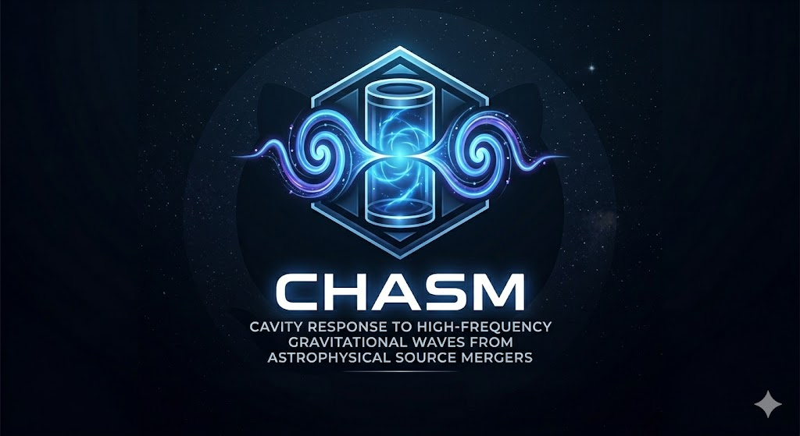

# CHASM --- Cavity Response Simulator 2.0

**CHASM** (Cavity Response to High-frequency gravitational waves from Astrophysical Source Mergers)\
computes the time evolution of electromagnetic cavity modes driven by the effective Gertsenshtein current generated by primordial black hole (PBH) mergers or early inspiral signals. The repo also contains tools to compute **GW–cavity coupling coefficients**.

------------------------------------------------------------------------

## Physics Overview

The cavity mode amplitude is obtained by solving

$$
\ddot c_n(t) + \frac{\omega_n}{Q}\dot c_n(t) + \omega_n^2 c_n(t)
= -\mathcal{I}_n(t)
$$

where the driving term is

$$
\mathcal{I}_n(t)=
\int dx_\parallel\, A_+(x_\parallel)\,\partial_t^2 h_+(t-x_\parallel/c)
+
\int dx_\parallel\, A_\times(x_\parallel)\,\partial_t^2 h_\times(t-x_\parallel/c)
$$

The transverse kernels

$$
A_{+,\times}(x_\parallel)
$$

are precomputed to reduce the original 3D integral to a 1D convolution,
dramatically improving numerical performance.

------------------------------------------------------------------------

## Pipeline

The code is split into 5 main scripts:

1. **`waveform.py`**  
   Generates PBH merger waveforms (saved as `.npy` under `data/`).
   ```bash
   python3 waveform.py --plot --clip
   ```

3. **`slice_integration.py`**  
   Computes the transverse slice integrals that couple to `+` and `×` GW polarisations for a chosen cavity geometry/mode and GW direction.
   ```bash
   python3 slice_integration.py --mode-fam TM --mode-par b --mode-ind 0,1,0
   ```

5. **`rhs.py`**  
   Builds the driving term (RHS) as a function of time using the slice integrals and a chosen waveform file in `data/`.
   ```bash
   python3 rhs.py --data GW_xxx --mode-fam TM --mode-par b --mode-ind 0,1,0
   ```

7. **`ode.py`**  
   Solves the driven damped oscillator equation for the mode amplitude `c_n(t)` using an RHS file and a chosen cavity quality factor `Q`.
   ```bash
   python3 ode.py --data GW_xxx --mode-fam TM --mode-par b --mode-ind 0,1,0
   ```

8. **`coupling_strength.py`**  
   Computes coupling coefficients to cavity modes as functions of GW direction (useful for early inspiral/monochromatic signals). Can be used independently.
   ```bash
   python3 coupling_strength.py --R 0.3 --L 0.2 --pol cross --mode-fam TM --mode-ind 0,1,0 --N-theta 50
   ```

------------------------------------------------------------------------
# Script Details

------------------------------------------------------------------------

## waveform.py

Generates PBH merger waveforms using PyCBC, PySEOBNR and gwmemory.

| Parameter | Default | Description |
|-----------|---------|-------------|
| `--m-absolute` | `1e-6` | Total mass (M_sun) |
| `--q` | `1` | Mass ratio m1/m2 |
| `--spin-1` | `(0,0,0)` | Spin vector of larger object |
| `--spin-2` | `(0,0,0)` | Spin vector of smaller object |
| `--eccentricity` | `0.0` | Orbital eccentricity |
| `--low_freq` | `1e8` | Lower frequency bound (Hz) |
| `--high_freq` | `1e11` | Upper frequency bound (Hz) |
| `--distance` | `1e-11` | Distance to source (pc) |
| `--inclination` | `0.0` | Inclination angle (rad) |
| `--polarization-angle` | `0.0` | Polarization angle (rad) |
| `--phi0` | `0.0` | Initial orbital phase (rad) |
| `--tc` | `0.0` | Time of coalescence (s) |
| `--approximant` | `IMRPhenomD` | Waveform model |
| `--clip` | `False` | Enable waveform clipping |
| `--clip-th1` | `0.2` | Primary clipping threshold |
| `--clip-th2` | `1e-4` | Secondary clipping threshold (tail) |
| `--memory` | `False` | Include GW memory |
| `--density-factor` | `2.0` | Density scaling factor |
| `--plot` | `False` | Plot waveform generation stages |
| `--data-dir` | `data` | Output directory for waveforms |
| `--output` | *(auto)* | Output filename |

------------------------------------------------------------------------

## slice_integration.py

Computes transverse kernels A_plus and A_cross.

| Parameter | Default | Description |
|-----------|---------|-------------|
| `--geometry` | `cylindrical` | Geometry (`cylindrical`, `spherical`, `rectangular`) |
| `--mode-fam` | `TM` | `TE` or `TM` |
| `--mode-par` | `b` | `a`, `b`, or `None` |
| `--mode-ind` | `0,1,0` | Mode indices |
| `--Bz` | `14.0` | Background magnetic field (T) |
| `--Ns` | `100` | Number of spatial steps |
| `--nproc` | `1` | Parallel processes |
| `--theta` | `45.0` | Polar angle of GW incidence (deg) |
| `--phi` | `0.0` | Azimuthal angle of GW incidence (deg) |
| `--R` | `0.04` | Radius (m) for cylindrical/spherical cavities |
| `--L` | `0.24` | Length (m) for cylindrical/spherical cavities |
| `--a` | `0.1` | Rectangular x-dimension (m) |
| `--b` | `0.1` | Rectangular y-dimension (m) |
| `--c` | `0.1` | Rectangular z-dimension (m) |
| `--results-dir` | `results` | Output directory |
------------------------------------------------------------------------

## rhs.py

Computes the driving term I_n(t).

| Parameter | Default | Description |
|-----------|---------|-------------|
| `--data` | *(required)* | Waveform identifier / filename stem |
| `--data-dir` | `data` | Directory with waveform data |
| `--results-dir` | `results` | Output directory |
| `--Nt` | `1000` | Number of time steps |
| `--theta` | `45.0` | Polar angle of GW incidence (deg) |
| `--phi` | `0.0` | Azimuthal angle of GW incidence (deg) |
| `--geometry` | `cylindrical` | Geometry |
| `--mode-fam` | `TM` | `TE` or `TM` |
| `--mode-par` | `b` | `a`, `b`, or `None` |
| `--mode-ind` | `0,1,0` | Mode indices |
| `--L` | `0.1` | Characteristic cavity length (m) |
| `--freq-match` | `False` | Match GW frequency to cavity resonant frequency |

------------------------------------------------------------------------

## ode.py

Solves the driven damped oscillator equation.

| Parameter | Default | Description |
|-----------|---------|-------------|
| `--results-dir` | `results` | Output directory |
| `--data` | *(required)* | Waveform identifier / RHS association |
| `--theta` | `45.0` | Polar angle of GW incidence (deg) |
| `--phi` | `0.0` | Azimuthal angle of GW incidence (deg) |
| `--Q` | `1e5` | Cavity quality factor |
| `--geometry` | `cylindrical` | Geometry |
| `--mode-fam` | `TM` | Mode family |
| `--mode-par` | `b` | `a`, `b`, or `None` |
| `--mode-ind` | `0,1,0` | Mode indices |
------------------------------------------------------------------------

## coupling_strength.py

Computes direction-dependent coupling C_gw(θ, φ).

| Parameter | Default | Description |
|-----------|---------|-------------|
| `--geometry` | `cylindrical` | Geometry (`cylindrical`, `spherical`, `rectangular`) |
| `--mode-fam` | `TM` | Mode family (`TM` or `TE`) |
| `--mode-ind` | `0,1,0` | Mode indices |
| `--R` | `0.1` | Radius (m) for cylindrical/spherical cavities |
| `--L` | `0.2`| Length (m) for cylindrical/spherical cavities |
| `--a` | *(required)* | Rectangular x-dimension (m) |
| `--b` | *(required)* | Rectangular y-dimension (m) |
| `--c` | *(required)* | Rectangular z-dimension (m) |
| `--pol` | `cross` | GW polarisation (`cross` or `plus`) |
| `--N-theta` | `10` | Number of polar angles sampled |
| `--N-phi` | `1` | Number of azimuthal angles sampled |
| `--nproc` | `1` | Parallel processes |
| `--save-dir` | `results/coupling` | Output directory |
| `--freq-match` | `False` | Match GW frequency to cavity resonant frequency |


------------------------------------------------------------------------

# The library installation procedure
### Using pyenv

```bash
pyenv install 3.10.0
pyenv virtualenv 3.10.0 cavity-response
pyenv activate cavity-response
pip install -r requirements.txt
```

### Using conda
```bash
conda create -n cavity-response python=3.10
conda activate cavity-response
pip install -r requirements.txt
```

